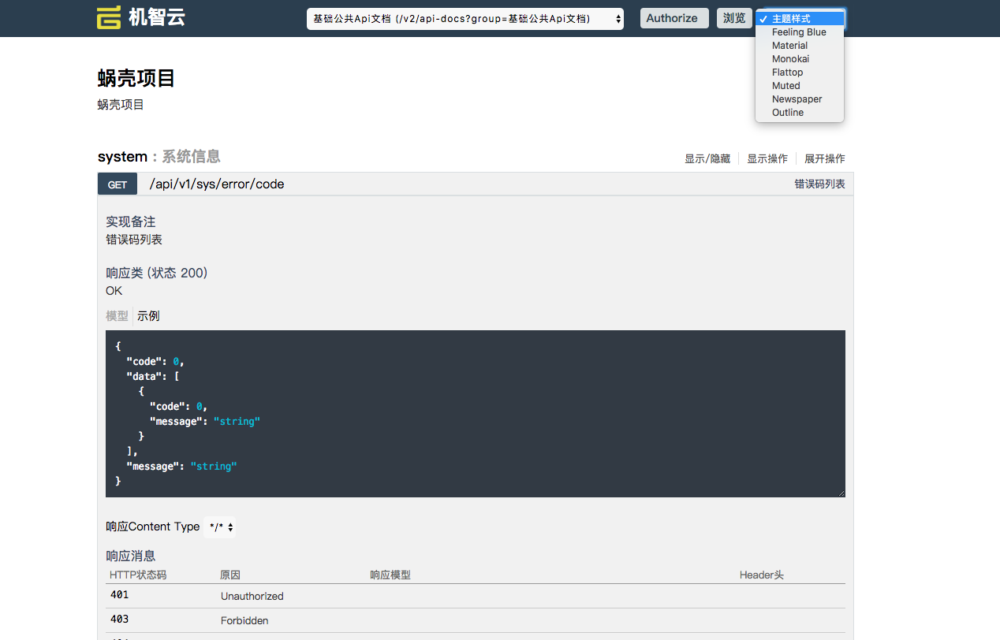

swagger-ui
===============================

自定义机智云风格的RESTful-API文档

```
  <dependency>
        <groupId>com.gizwits</groupId>
        <artifactId>springfox-swagger-ui</artifactId>
        <version>2.7.0</version>
  </dependency>

```

支持如下8种主题样式

* 默认
* Feeling Blue
* Material
* Monokai
* Flattop
* Muted
* Newspaper
* Outline


* 主题样式风格如下

